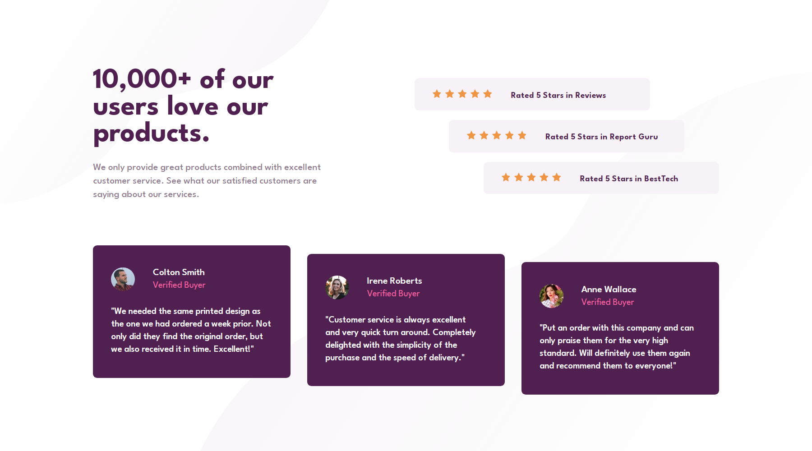

# Frontend Mentor - Social proof section solution

This is a solution to the [Social proof section challenge on Frontend Mentor](https://www.frontendmentor.io/challenges/social-proof-section-6e0qTv_bA). Frontend Mentor challenges help you improve your coding skills by building realistic projects. 

## Table of contents

- [The challenge](#the-challenge)
- [Screenshot](#screenshot)
- [Links](#links)
- [Author](#author)

## The challenge

Users should be able to:

- View the optimal layout for the section depending on their device's screen size

## Screenshot

## Links

- Solution URL: [GitHub Repository](https://github.com/joangute/social-proof-section/)
- Live Site URL: [GitHub Pages](https://joangute.github.io/social-proof-section/)

## Author

- Frontend Mentor - [@joangute](https://www.frontendmentor.io/profile/joangute)